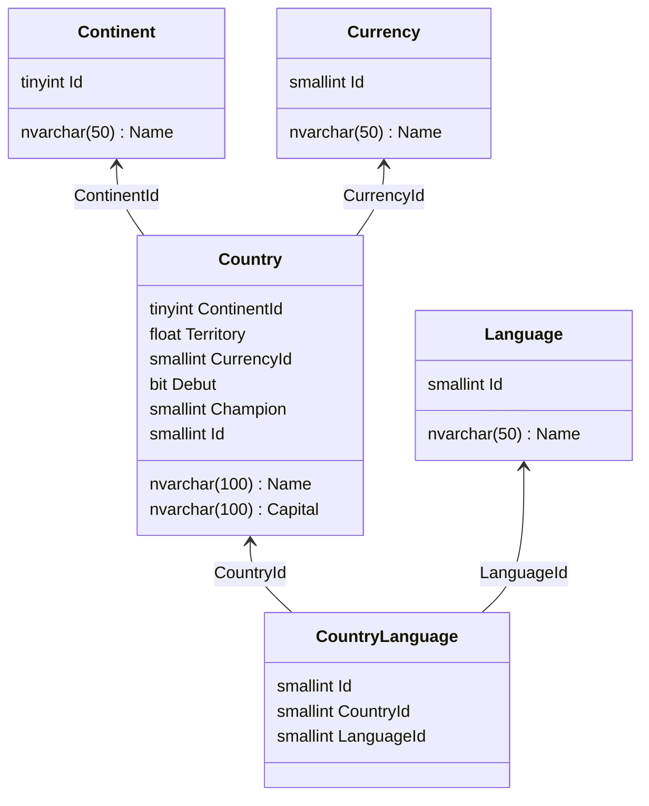

```mermaid

classDiagram
direction BT
class Continent {
   nvarchar(50) Name
   tinyint Id
}
class Country {
   nvarchar(100) Name
   tinyint ContinentId
   nvarchar(100) Capital
   float Territory
   smallint CurrencyId
   bit Debut
   smallint Champion
   smallint Id
}
class CountryLanguage {
   smallint Id
   smallint CountryId
   smallint LanguageId
}
class Currency {
   nvarchar(50) Name
   smallint Id
}
class Language {
   nvarchar(50) Name
   smallint Id
}

Country  -->  Continent : ContinentId
Country  -->  Currency : CurrencyId
CountryLanguage  -->  Country : CountryId
CountryLanguage  -->  Language : LanguageId

```